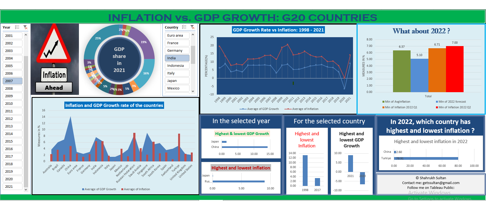
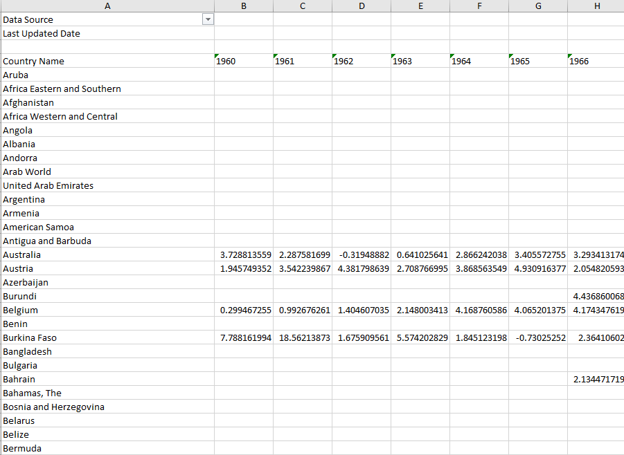
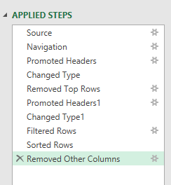
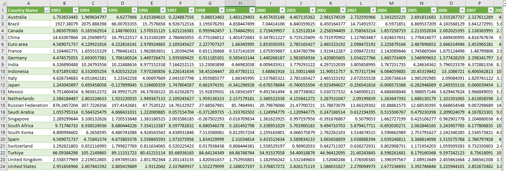
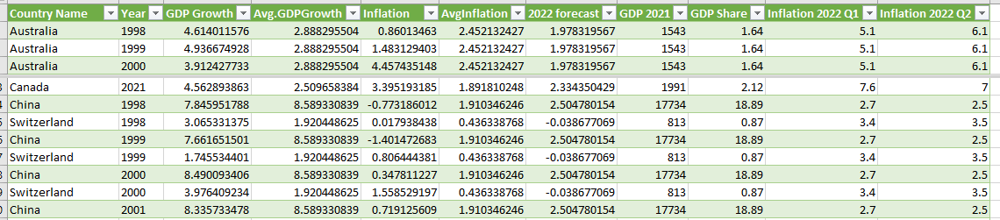

# Analysis of Inflation and GDP growth: G20 Countries
Hello ! Nice to see you here. Please read the qoute below.


Do you beleive in the above qoute ? You may beleive this or not, but you can't deny that all countries are facing economic slowdown due to high inflation in 2022. There are lot of reasons for inflation. I studied two major reasons for high inflation all over the world in 2022 are - 
- Covid 19 pandemic.
- Russia vs. Ukraine war.

The second reason affected me personally. When I realised how inflation can affect normal consumers I decided to study more about inflation in different countries and  **as a curious data analyst** I gathered some data and prepared a report about inflation and GDP growth rate in G20 countries from 1998 to 2022. I have designed an interactive dashboard that shows the following insights
- Inflation vs GDP growth rate in G20 countries in a selected year.
- In a particular year which country had highest inflation, lowest inflation and highest GDP growth rate, lowest GDP growth rate ?
- For a selected country inflation vs GDP growth rate from 1998 to 2021. Recent inflation in the country in 2022. Is it higher than all time average ? Is it higher than forecasted rate ? 
- For a selected country the best year and the worst year for Inflation and GDP growth rate.
- Which country having highest inflation in 2022? 



**Note: The inflation data shows percentage(%) of annual inflation in CPI(Consumer price index)**

## Technical details
### Used tools:
**Excel Power Query, Pivot tables, Pivot charts.**

All the stages of the project are discussed below step by step.
### 1. Data Collection and Extraction
#### Dataset 1: 
Data set 1 contains annual GDP growth rate of all the countries from 1960 to 2021. This data set is collected from [The World Bank Data:GDP Growth](https://data.worldbank.org/indicator/NY.GDP.MKTP.KD.ZG).

#### Dataset 2:
Data set 2 contains annual inflation rate in all the countries of the world. It is donwloaded from [The World Bank Data: Inflation](https://data.worldbank.org/indicator/FP.CPI.TOTL.ZG).

#### Dataset 3: 
This data set contains the total GDP of G20 countris in 2021. This dataset is extracted using **Excel Power Query** from the website [Trading Economics: GDP G20 2021](https://tradingeconomics.com/country-list/gdp?continent=g20).

#### Data set 4:
This dataset contains the inflation of G20 countries in 2022. It is extracted using **Excel Power Query** from the website [Trading Economics Inflation G20 2022](https://tradingeconomics.com/country-list/inflation-rate?continent=g20).

Both dataset 3 and Dataset 4 is extracted in the same [excel file](https://github.com/shakhscode/Inflation_Report-1993-2022/blob/main/GDPandRecent.xlsx)


> To extract data from websites using **Excel Power Query**:
- Go to **Data** tab in excel. Then select **New Query > From Other Sources > From web**.
- Enter the link of the website and click 'Ok' and then extract the data as required.

After extracting they are merged using **Excel Power Query**.
> To merge(join) two tables from the same workbook using Power Query 
- Go to **Data> New Query > Combine Queries > Merge**.

### 2. Data cleaning 
Dataset 3 and 4 are already in clean format. But dataset 1 and 2 are messy and not cleaned.

The raw data (dataset 1 and 2) look like this.


Now its time to clean dataset 1 and dataset 2. For data cleaning using Power Query
- Open a new Excel Workbook. Go to **Data > New Query > From File > From Excel Workbook** and open the raw dataset.
- Using Power Query editor dataset is cleaned and only data for G20 countries from year 1998 to 2021 are loaded.
- Similarly data set 2 was cleaned and loaded in the same [excel workbook](https://github.com/shakhscode/Inflation_Report-1993-2022/blob/main/cleanedForecastedUnpivotedFinalData.xlsx)

Queries for data cleaning.



And the cleaned dataset looks like this.



### 3. Forecasting and other calculations
In order to compare the expected inflation and real inflation in 2022, a time series forecasting is carried out using the Excel formula
```
FORECAST.ETS(target_date, values, timeline, [seasonality], [data_completion], [aggregation])
```
Other parameters calculated are 'Average GDP growth rate' and 'Average inflation rate'. 

### 4. Data transformation and final join
Cleaned and merged dataset is in pivoted format.


But to visualize or to make a dashboard it is required to unpivot it.

- Using Power Query 'Unpivot columns' option GDP data and inflation data are unpivoted and transformed separately in the same workbook.
> To unpivot a table first select the table and then go to **Data> From Table** then selects the columns to unpivot.
- Now 'RecentGDP_Inflation.xlxs' file is  loaded to the same workbook. 
- Now all the unpivoted tables are merged together and  dataset is ready to visualize.



### 5. Designing a  dashboard in Excel
- Dashboard is designed using Pivot charts. 
- Slicer and timeline slicers are used to make the charts interactive.
- Slicers are connected to multiple pivot charts to make the dashboard more interactive and dynamic.
- Do make the dashboard dynamic first several pivot tables are created and then using MATCH() and INDEX() function highest and lowest value cells are selected.

Finally here is the dashboard desinged in Excel.


https://user-images.githubusercontent.com/76909183/193636718-cb812552-a9fa-4acb-a35a-df4fae3e9808.mp4

### 6. Desiging a dashboard in Tableau.
[To experience the full features visit tableau public](link to tableu Public)

[Also feel free to download the tableau workbook]

The HIGHLIGHT section is completely dynamic. Based on the selected year and country highlight changes automatically. This is done using table calculation function RANK().


