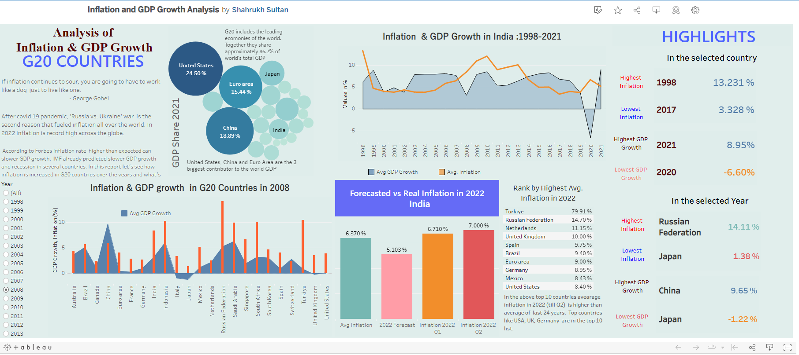

# Inflation and GDP Growth Analysis: G20 Countries
### Aim of the project:
Analysing inflation and GDP growth rate in G20 countries and preparing a visual report that shows the following insights
- How inflation and GDP growth rate changed in G20 countries from 1998 to 2022.
- In a particular year which country faced highest inflation, lowest inflation and had highest GDP growth rate, lowest GDP growth rate ?
- For a particular G20 country which was the best year and the worst year for Inflation and GDP growth rate.
- Is inflation in 2022 higher than all time average ? Is it higher than forecasted rate ? 

### Used tools:
- Excel Power Query - For data extraction and data cleaning
- Pivot Tables and Pivot Charts - To design an interactive dashboard.

### Experience gained:
Data Extraction,Data Cleaning, Data Transformation and Integration, Dashboarding

### Final Output:

#### Dashboard in Excel

https://user-images.githubusercontent.com/76909183/193636718-cb812552-a9fa-4acb-a35a-df4fae3e9808.mp4

**Note: The dashboard shows percentage(%) of annual inflation in CPI(Consumer price index)**

(Previously I worked with Excel charts only, but its my first time designing a dashboard in Excel using Pivot tables and Pivot charts.)


#### Dashboard in Tableau
I have also designed a dashboard in Tableau that has simillar interactive and dynamic features. To experience the full features of the dashboard [please visit my tableau public profile.](https://public.tableau.com/app/profile/shahrukh.sultan/viz/InflationandGDPGrowthAnalysis/Dashboard1)


(You can download the tableau workbook, it is uploaded as TableauDashboard.twb)

## Detailed Explanation
#### Contents of the repository
[1. Data Collection and Extraction](#1-data-collection-and-extraction)

[2. Data cleaning](#2-data-cleaning)

[3. Forecasting and other calculations](#3-forecasting-and-other-calculations)

[4. Data transformation and final join](#4-data-transformation-and-final-join)

[5. Designing a dashboard in Excel](#5-designing-a-dashboard-in-excel)

[6. Desiging a dashboard in Tableau](#6-desiging-a-dashboard-in-tableau)

[Motivation behind the project](#motivation-behind-the-project)

### 1. Data Collection and Extraction
#### Dataset 1: 
Data set 1 contains annual GDP growth rate of all the countries from 1960 to 2021. This data set is collected from [The World Bank Data:GDP Growth](https://data.worldbank.org/indicator/NY.GDP.MKTP.KD.ZG).

#### Dataset 2:
Data set 2 contains annual inflation rate in all the countries of the world. It is donwloaded from [The World Bank Data: Inflation](https://data.worldbank.org/indicator/FP.CPI.TOTL.ZG).

#### Dataset 3: 
This data set contains the total GDP of G20 countris in 2021. This dataset is extracted using **Excel Power Query** from the website [Trading Economics: GDP G20 2021](https://tradingeconomics.com/country-list/gdp?continent=g20).

#### Data set 4:
This dataset contains the inflation of G20 countries in 2022. It is extracted using **Excel Power Query** from the website [Trading Economics Inflation G20 2022](https://tradingeconomics.com/country-list/inflation-rate?continent=g20).

Both dataset 3 and Dataset 4 is extracted in the same [excel file](https://github.com/shakhscode/Inflation_Report-1993-2022/blob/main/GDPandRecent.xlsx)


> To extract data from websites using **Excel Power Query**:
- Go to **Data** tab in excel. Then select **New Query > From Other Sources > From web**.
- Enter the link of the website and click 'Ok' and then extract the data as required.

After extracting they are merged using **Excel Power Query**.
> To merge(join) two tables from the same workbook using Power Query 
- Go to **Data> New Query > Combine Queries > Merge**.

### 2. Data cleaning 
Dataset 3 and 4 are already in clean format. But dataset 1 and 2 are messy and not cleaned.

The raw data (dataset 1 and 2) look like this.


Now its time to clean dataset 1 and dataset 2. For data cleaning using Power Query
- Open a new Excel Workbook. Go to **Data > New Query > From File > From Excel Workbook** and open the raw dataset.
- Using Power Query editor dataset is cleaned and only data for G20 countries from year 1998 to 2021 are loaded.
- Similarly data set 2 was cleaned and loaded in the same [excel workbook](https://github.com/shakhscode/Inflation_Report-1993-2022/blob/main/cleanedForecastedUnpivotedFinalData.xlsx)

Queries for data cleaning.


And the cleaned dataset looks like this.


### 3. Forecasting and other calculations
In order to compare the expected inflation and real inflation in 2022, a time series forecasting is carried out using the Excel formula
```
FORECAST.ETS(target_date, values, timeline, [seasonality], [data_completion], [aggregation])
```
Other parameters calculated are 'Average GDP growth rate' and 'Average inflation rate'. 

### 4. Data transformation and final join
Cleaned and merged dataset is in pivoted format.


But to visualize or to make a dashboard it is required to unpivot it.

- Using Power Query 'Unpivot columns' option GDP data and inflation data are unpivoted and transformed separately in the same workbook.
> To unpivot a table first select the table and then go to **Data> From Table** then selects the columns to unpivot.
- Now 'RecentGDP_Inflation.xlxs' file is  loaded to the same workbook. 
- Now all the unpivoted tables are merged together and  dataset is ready to visualize.


### 5. Designing a dashboard in Excel
- Dashboard is designed using Pivot charts. 
- Slicer and timeline slicers are used to make the charts interactive.
- Slicers are connected to multiple pivot charts to make the dashboard more interactive and dynamic.
- To make the dashboard dynamic first several pivot tables are created and then using MATCH() and INDEX() function highest and lowest value cells are selected.


### 6. Desiging a dashboard in Tableau
Compared to Excel, ofcourse Tableau is far better to design the charts, apply interactive and dynamic filters.
In the [above dashboard](#dashboard-in-tableau), HIGHLIGHT section is completely dynamic. Based on the selected year and country highlight changes automatically. This is done using table calculation function RANK().

***
## Motivation behind the project


Do you beleive in the above quote ? You may beleive this or not, but you can't deny that all countries are facing economic slowdown due to high inflation in 2022. There are lot of reasons for inflation. As I studied in some financial articles two major reasons for record high inflation around the world in 2022 are - 
- Covid 19 pandemic.
- Russia vs. Ukraine war.

The second reason affected me personally. I was in Saint Petersburg (Second largest Russian City) till September. The war was started on 24th Feb. As an international student for the first two weeks did not feel any change due to the war. But after 2 weeks I realised how a war impacts both the countries.
 
After two weeks price of every essential commodity started increasing. As a student with limited budget I suffered a lot. Had to pay 20% to 130% more on the groceries, food items I used to buy. Although I studied Inflation in secondary school, but that was the first time I experienced inflation closely just within 2 weeks. 

After that, I started following news about inflation around the world and the term inflation was consitently in my mind.**So, as a curious data analyst** I gathered some data and prepared a report about inflation and GDP growth rate in G20 countries from 1998 to 2022. I had chosen only G20 countries, as G20 countries contribute almost 85% of world's GDP and includes all the major economies of the world.


